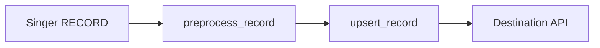

# AGENTS.md - AI Agent Development Guide for target-intacct


This document provides guidance for AI coding agents and developers working on this Singer target.

## Project Overview

- **Project Type**: Singer Target (Hotglue Singer SDK / `TargetHotglue`)
- **Destination**: Intacct
- **Sinks**: BankAccount | record, CreditCardAccount | record, BankTransaction | record, CreditCardTransaction | record (each entry: `SinkName | record` or `SinkName | batch`)
- **Auth (at scaffold time)**: OAuth2
- **Base URL default**: https://api.intacct.com/ia/api/v1
- **Framework**: [Hotglue Singer SDK](https://github.com/hotgluexyz/hotglue-singer-sdk)

## Architecture

This target follows the Singer specification and loads data into **Intacct** using **`TargetHotglue`** and HTTP sink classes from **`hotglue_singer_sdk.target_sdk`**.

### Key components

1. **`target_intacct/target.py`** — `TargetIntacct`: `name`, `SINK_TYPES`, `config_jsonschema`, `default_sink_class`, and `access_token_support` for OAuth2.
1. **`target_intacct/client.py`** — `IntacctSink` (shared `base_url`, `authenticator`), plus record/batch sink bases used by `sinks.py`.
1. **`target_intacct/sinks.py`** — One sink class per stream from the scaffolded `sinks` list.
1. **`target_intacct/auth.py`** — Present **only when `auth_method` is OAuth2** (otherwise removed by `hooks/post_gen_project.py` after generation). Defines `IntacctAuthenticator`.
1. **`hooks/post_gen_project.py`** (in the **cookiecutter template repo**, not always copied into generated projects as source) — Normalizes license files, optional `.vscode` removal, `auth.py` deletion for non-OAuth2, and renames or drops `AGENTS.md` per `include_agent_instructions`.

### Authentication (`OAuth2`)

| `auth_method` | Where it lives |
|---------------|----------------|
| **OAuth2** | `auth.py`: `IntacctAuthenticator` (refresh token). `target.py`: `access_token_support` returns that class and the token endpoint (replace the TODO URL). `client.py`: builds the authenticator via `access_token_support`. |
| **Bearer Token** | `client.py`: `BearerTokenAuthenticator`. |
| **Basic Auth** | `client.py`: `BasicAuthenticator` with `username` / `password` from config — keep `config_jsonschema` and `.secrets/config.json` aligned with real keys. |
| **API Key** | `client.py`: `ApiAuthenticator` (`access_key`, optional `access_key_header_name`, `access_key_prefix`). |

Sample secrets for local runs: **`.secrets/config.json`** (keys align with `auth_method` and `config_jsonschema` in `target.py`: OAuth2, Basic Auth, Bearer `access_token`, or API key fields).

## Development Guidelines for AI Agents

### Understanding Singer Target Concepts

Before making changes, ensure you understand these concepts:

- **Records**: Individual data items received from taps
- **Schemas**: JSON Schema definitions describing record structure
- **State**: Bookmark information passed through from taps
- **Batching**: Grouping records for efficient loading
- **MAX_SIZE**: Maximum records per batch

### Sinks and serialization

Sink list (same as in **Project overview**): **BankAccount | record, CreditCardAccount | record, BankTransaction | record, CreditCardTransaction | record**. Implement stream-specific classes in `sinks.py`; shared HTTP and `authenticator` live in `client.py`.

### Implementing a Sink


#### Record sinks (`| record`)

Records are handled one at a time through `IntacctRecordSink` in `client.py`. Stream-specific subclasses in `sinks.py` inherit that base and override hooks as needed.

**Flow:**



**Transformation vs. load:** Do **not** reshape the payload inside `upsert_record`. `preprocess_record` is defined on the parent record sink class — override it in your **sink subclass** in `sinks.py` to transform the record (field renames, types, nesting) before `upsert_record` runs.

`upsert_record` should only perform the HTTP write using the already-transformed `record` (method, endpoint, request body). The scaffold in `client.py` shows a typical POST/PATCH pattern; override in a stream sink only when that stream’s API contract differs.

```python
# target_intacct/sinks.py
class ContactsSink(IntacctRecordSink):
  name = "Contacts"

  def preprocess_record(self, record: dict, context: dict) -> dict:
    # Shape payload for the destination API before upsert_record runs.
    return {
      "first_name": record.get("firstName"),
      "last_name": record.get("lastName"),
      "email": record.get("email"),
    }

  # Optional: override upsert_record only for stream-specific HTTP behavior.
  # def upsert_record(self, record: dict, context: dict) -> None:
  #     ...
```

**Error handling and retries:** Raise SDK retryable errors for transient failures (timeouts, 429, 5xx). Use fatal errors for auth or schema issues. Let the SDK handle backoff where configured.


### Batching Logic


This project was generated without batch sinks. To add batching, extend the cookiecutter `sinks` prompt with entries such as `Orders | batch` and implement `IntacctBatchSink` subclasses in `sinks.py`.


### Cookiecutter context (this repo)

These values were set at scaffold time. In the **cookiecutter template** they appear as Jinja placeholders such as {{ cookiecutter.destination_name }} (one per key in `cookiecutter.json`). In this generated document, file paths mostly show the resolved values.

- **`destination_name`** / **`target_id`** / **`library_name`** — Names and import path for the Python package.
- **`sinks`** — Comma-separated `Name | record` or `Name | batch` list; drives generated sink classes, `SINK_TYPES` (sink class objects), and `sinks.py`.
- **`auth_method`** — One of: Bearer Token, Basic Auth, API Key, OAuth2.
- **`base_url`** — Default API base URL in `client.py` (or override with the property stub when empty).
- **`license`** / **`include_agent_instructions`** — Handled in `post_gen_project.py` (license filenames, `AGENTS.md` vs `CLAUDE.md` vs none).

When editing the **template** upstream, mirror changes in `cookiecutter.json`, `hooks/post_gen_project.py`, and the Jinja under `target-intacct/`.

### Common Tasks

#### Modifying Data Loading Logic

1. Override sink methods in `target_intacct/sinks.py`
1. Record sinks: transform in `preprocess_record`; batch sinks: transform in `process_batch_record`
1. Handle destination-specific formatting
1. Implement error handling and retries

#### Adding Configuration Options

Define new config properties in target class:

```python
from hotglue_singer_sdk import typing as th
from hotglue_singer_sdk.target_sdk.target import TargetHotglue

class TargetIntacct(TargetHotglue):
    config_jsonschema = th.PropertiesList(
        th.Property("api_url", th.StringType, required=True),
        th.Property("api_key", th.StringType, required=True),
        th.Property("timeout", th.IntegerType, default=300),
    ).to_dict()
```

Configuration best practices:

- Provide sensible defaults
- Validate in `__init__`
- Document all options in README

#### Connection Management

For API/HTTP targets:

```python
# Use requests.Session for connection reuse
import requests

self.session = requests.Session()
self.session.headers.update({"Authorization": f"Bearer {api_key}"})
```

Implement retry logic for transient failures.

#### Error Handling

Implement robust error handling:

```python
try:
    # Load data
    result = self.load_data(records)
except RetryableError as e:
    # SDK will retry
    raise e
except FatalError as e:
    # Log and fail the sync
    self.logger.error(f"Fatal error: {e}")
    raise e
```

Types of errors:

- **Retryable**: Network issues, rate limits, temporary failures
- **Fatal**: Authentication errors, invalid data, configuration issues

#### Type Mapping


```python
def preprocess_record(self, record: dict, context: dict) -> dict:
    """Convert types for destination (record sinks only)."""
    if "timestamp" in record:
        record = {**record, "timestamp": parse_datetime(record["timestamp"])}
    return record
```


### Testing

Test your target implementation:

```bash
# Install dependencies
uv sync

# Run tests
uv run pytest

# Test with sample data
cat sample_data.singer | target-intacct --config config.json

# Test with a tap
tap-something --config tap_config.json | target-intacct --config config.json
```

Create test fixtures:

```python
# tests/test_core.py
def test_target_loads_data():
    with open("tests/fixtures/input.singer") as f:
        lines = f.readlines()

    # Process lines
    # Verify data loaded correctly
```

### Performance Optimization

1. **Batching**: Use appropriate batch sizes

   - Too small: Many API calls, slow
   - Too large: Memory issues, timeouts
   - Start with 1000-5000, adjust based on record size

1. **Parallel Processing**: For multi-table targets

   - SDK handles streams in sequence by default
   - Consider async operations within batches

1. **Connection Pooling**: Reuse connections

   - Use `requests.Session` for HTTP
   - Connection pools for databases

1. **Memory Management**:

   - Don't accumulate records beyond batch size
   - Stream large files rather than loading into memory
   - Use generators where possible

### Schema Handling

For schema-aware targets:

- Validate records against schema
- Handle schema evolution
- Map nested objects appropriately
- Consider denormalization for flat destinations

### State Management

Targets receive and forward state:

- Don't modify state in targets
- Emit state messages as received
- State used for tap bookmarking

```python
def process_state_message(self, message_dict: dict) -> None:
    """Handle state message."""
    super().process_state_message(message_dict)
    # Optional: Checkpoint or log state
```

### Keeping configuration in sync

`config_jsonschema` in `target.py` is the source of truth for target settings. Keep related files aligned so local runs and documentation stay accurate.

**When to sync:**

- Adding new configuration properties to the target
- Removing or renaming existing properties
- Changing property types, defaults, or descriptions
- Marking properties as required or secret

**How to sync:**

1. Update `config_jsonschema` in `target_intacct/target.py`
1. Update `.secrets/config.json` with example values for the chosen `auth_method`
1. Update `.env.example` if you use environment-variable overrides

Example - adding a new `batch_size` setting:

```python
# target_intacct/target.py
config_jsonschema = th.PropertiesList(
    th.Property("api_url", th.StringType, required=True),
    th.Property("api_key", th.StringType, required=True, secret=True),
    th.Property("batch_size", th.IntegerType, default=1000),  # New setting
).to_dict()
```

```json
// .secrets/config.json (add matching keys)
{
  "api_url": "https://api.example.com",
  "api_key": "your_api_key_here",
  "batch_size": 1000
}
```

```bash
# .env.example uses the target_id-derived prefix (see that file for the exact prefix)
TARGET_INTACCT_API_URL=https://api.example.com
TARGET_INTACCT_API_KEY=your_api_key_here
TARGET_INTACCT_BATCH_SIZE=1000  # New setting
```

**Best practices:**

- Update `target.py`, `.secrets/config.json`, and `.env.example` in the same commit when config changes
- Use the same default values in all locations
- Keep descriptions consistent between `config_jsonschema` and README

### Common Pitfalls

1. **Memory Leaks**: Clear batch data after processing
1. **Connection Limits**: Close connections properly
1. **Partial Failures**: Handle failed records in batch
1. **Schema Changes**: Handle additive schema changes
1. **Rate Limiting**: Implement backoff and retry
1. **Authentication**: Refresh tokens before expiry
1. **Timezone Issues**: Use UTC consistently

### SDK resources

- [Hotglue Singer SDK](https://github.com/hotgluexyz/hotglue-singer-sdk) (this target’s runtime)
- [Singer specification](https://github.com/singer-io/getting-started/blob/master/SPEC.md)

### Best Practices

1. **Logging**: Use structured logging with `self.logger`
1. **Idempotency**: Handle duplicate records gracefully
1. **Transactions**: Use transactions for consistency
1. **Validation**: Validate data before loading
1. **Documentation**: Update README with config options
1. **Type Safety**: Use type hints
1. **Testing**: Test with various data types and edge cases
1. **Error Messages**: Provide actionable error information

## File Structure

```
target-intacct/
├── target_intacct/
│   ├── __init__.py
│   ├── __main__.py
│   ├── target.py          # TargetHotglue subclass, config_jsonschema, access_token_support
│   ├── client.py          # Base sink, authenticator, record/batch bases
│   ├── sinks.py           # Stream-specific sinks

│   ├── auth.py            # OAuth2 refresh-token authenticator

│   └── ...
├── .secrets/
│   └── config.json        # Example secrets (shape depends on auth_method)
├── tests/
│   ├── __init__.py
│   └── test_core.py
├── pyproject.toml
├── .env.example
└── README.md
```

## Additional Resources

- Project README: See `README.md` for setup and usage
- [Hotglue Singer SDK](https://github.com/hotgluexyz/hotglue-singer-sdk)
- [Singer specification](https://github.com/singer-io/getting-started/blob/master/SPEC.md)

## Making Changes

When implementing changes:

1. Understand the data flow: records → processing → destination
1. Follow Singer and SDK patterns
1. Test with real data from various taps
1. Handle edge cases (nulls, large records, schema changes)
1. Update documentation
1. Ensure backward compatibility
1. Run linting and type checking

## Questions?

If you're uncertain about an implementation:

- Check SDK documentation for sink examples
- Review other Singer targets for patterns
- Test incrementally with sample data
- Validate against the Singer specification
- Consider data consistency and idempotency

## Bumping the Hotglue Singer SDK version

When upgrading **`hotglue-singer-sdk`** in `pyproject.toml`, follow these steps to avoid breaking changes:

1. **Check the Hotglue Singer SDK changelog and release notes** before upgrading.

1. **Update the dependency** in `pyproject.toml`:

   ```toml
   [project]
   dependencies = [
       "hotglue-singer-sdk>=X.Y.Z",
   ]
   ```

1. **Re-sync your environment** and run the full test suite:

   ```bash
   uv sync
   uv run pytest
   ```

1. **Address deprecation warnings**: Run with warnings enabled to catch anything that will become an error in a future release:

   ```bash
   uv run pytest -W error::DeprecationWarning
   ```

1. **Check the changelog** for any behavioral changes that affect your target, even if not surfaced by warnings (e.g. batching, sink processing, schema handling).

## Reporting SDK issues

If you encounter a bug in **Hotglue Singer SDK** behavior used by this target (`hotglue_singer_sdk`, `TargetHotglue`, target SDK helpers), report it where that package is maintained. Include SDK and Python versions plus a minimal reproduction case.
